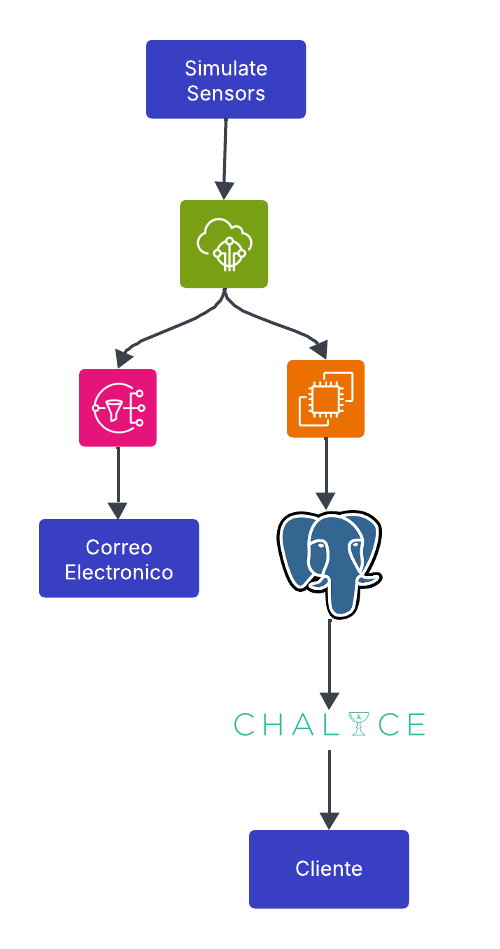
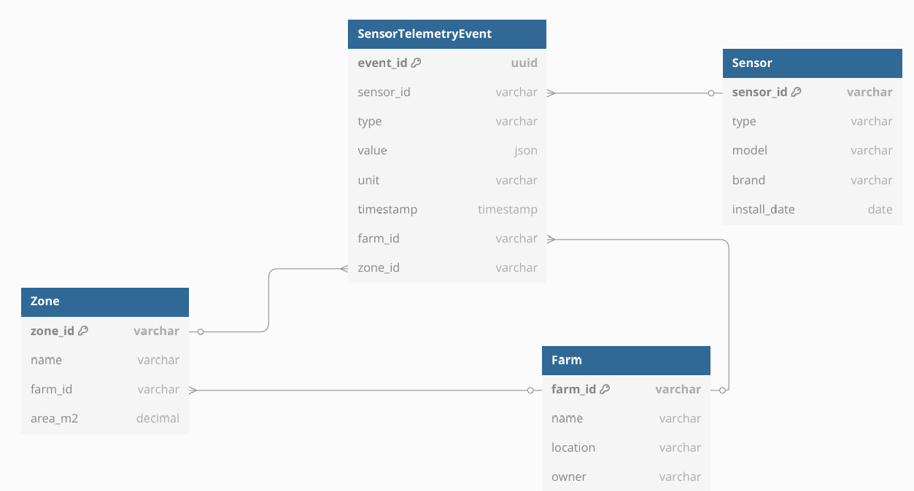

# Smart Agriculture IoT Application

This repository contains a complete IoT solution for smart agriculture, using AWS IoT Core, EC2, PostgreSQL, and AWS Chalice. It includes:

* **Sensor Simulator** (`simulator/`): publishes simulated MQTT data from real-world sensors (soil moisture, soil NPK, weather station).
* **EC2 Subscriber** (`ec2-subscriber/`): subscribes to MQTT topics and stores incoming events in PostgreSQL.
* **REST API with Chalice** (`api-chalice/api/`): manages sensors and actuators, and retrieves events from the database.
* **IoT Core Rules + SNS**: send email alerts when sensors exceed defined thresholds.

---

## 1.  Research and Design

Before implementation, research and design are crucial. As part of Phase 1, each group should:

1. **Choose an IoT application sector**, such as:

   * Agriculture
   * Healthcare
   * Logistics
   * Energy
   * Smart Cities
   * Industry 4.0
   * Etc.

2. **Investigate which sensors and actuators** are typically used in that sector. For Agriculture, we focus on:

   * Soil moisture sensors
   * Soil nutrient sensors (NPK)
   * Weather stations
   * Irrigation valves
   * Water pumps
   * GPS collars for livestock
   * (List other relevant sensors/actuators as needed)

3. **Design MQTT topics** following best practices. Topics used in this project:

   * `smartagri/{farm_id}/{zone_id}/sensor/soil_moisture/{sensor_id}/telemetry`
   * `smartagri/{farm_id}/{zone_id}/sensor/soil_npk/{sensor_id}/telemetry`
   * `smartagri/{farm_id}/{zone_id}/sensor/weather_station/{sensor_id}/telemetry`
   * `smartagri/{farm_id}/{zone_id}/actuator/{actuator_type}/{actuator_id}/command`

   Use hierarchical structure: `<project>/<farm>/<zone>/sensor/<type>/<id>/telemetry` and `<project>/<farm>/<zone>/actuator/<type>/<id>/command`.

---

## 2. Sensor Descriptions

For this application, we use three simulated sensors relevant to smart agriculture:

1. **Soil Moisture (SM)**

   * Measures soil moisture as a percentage (%).
   * Simulated range: 10% to 50%.
   * MQTT topic:

     ```
     smartagri/{farm_id}/{zone_id}/sensor/soil_moisture/{sensor_id}/telemetry
     ```

2. **Soil NPK (NPK)**

   * Measures soil nutrient levels:

     * **N** = Nitrogen (essential for leaf growth).
     * **P** = Phosphorus (important for root and flower development).
     * **K** = Potassium (regulates water balance and disease resistance).
   * Each value is simulated between 1 and 5 (relative units).
   * MQTT topic:

     ```
     smartagri/{farm_id}/{zone_id}/sensor/soil_npk/{sensor_id}/telemetry
     ```

3. **Weather Station (WS)**

   * Measures environmental conditions:

     * **temperature** in °C (15°C to 35°C).
     * **humidity** in % (30% to 90%).
   * MQTT topic:

     ```
     smartagri/{farm_id}/{zone_id}/sensor/weather_station/{sensor_id}/telemetry
     ```

**Example JSON Payload**:

```
{
  "sensor": "SM01",
  "type": "soil_moisture",
  "value": 32.7,
  "unit": "%",
  "timestamp": "2025-05-28T01:17:30.459Z"
}
```

---

## 3. Repository Structure

```
aws-iot-smart-agriculture/
├─ api-chalice/           # Chalice Microservice (REST API)
│  ├─ api/
│  │  ├─ app.py
│  │  ├─ requirements.txt
│  │  ├─ .env.example
│  │  └─ .chalice/config.json
│  └─ venv/              # (Optional) Virtualenv for Chalice
├─ ec2-subscriber/       # MQTT Subscriber on EC2
│  ├─ subscriber.py
│  ├─ .env.example
│  └─ certs/             # Certificates (kept out of Git)
├─ simulator/            # Sensor Simulator
│  ├─ simulate_sensors.py
│  ├─ .env.example
│  └─ certs/             # AWS IoT Core certificates
├─ .gitignore
└─ README.md             # This file
```

---

## 4. General Prerequisites

Before running any component, you need:

1. **AWS Account** with permissions to:

   * Create/manage AWS IoT Core, EC2, SNS, IAM, and RDS resources (or run Docker on EC2).
   * Use AWS CLI configured locally.

2. **AWS CLI installed on Windows** (optional for Chalice local).

   * Run `aws configure` to enter your Access Key, Secret Key, region `us-east-1`, and output format `json`.

3. **Git Bash** or PowerShell to run scripts and make HTTP requests (`curl`/`Invoke-RestMethod`).

4. **Docker Desktop on Windows** (only if testing Chalice local against a local Postgres Docker container).

5. **Python 3.x** installed on Windows.

---

## 5. AWS IoT Core Setup (Certificates and Policies)

These steps were already performed for the simulator and subscriber; here is a summary:

1. **Create a certificate**: in AWS IoT Core → **Secure → Certificates → Create certificate** (One-click).

   * Download: `certificate.pem.crt`, `private.pem.key`, and `AmazonRootCA1.pem`.

2. **Create an IoT policy** (e.g., `IoTSubscriberPolicy`):

   ```json
   {
     "Version": "2012-10-17",
     "Statement": [
       {
         "Effect": "Allow",
         "Action": [ "iot:Connect" ],
         "Resource": [
           "arn:aws:iot:us-east-1:YOUR_ACCOUNT_ID:client/*"
         ]
       },
       {
         "Effect": "Allow",
         "Action": [
           "iot:Publish",
           "iot:Subscribe",
           "iot:Receive"
         ],
         "Resource": [
           "arn:aws:iot:us-east-1:YOUR_ACCOUNT_ID:topic/smartagri/*",
           "arn:aws:iot:us-east-1:YOUR_ACCOUNT_ID:topicfilter/smartagri/*"
         ]
       }
     ]
   }
   ```

3. **Attach** that policy to the certificate.

> Those certificates are then placed under `simulator/certs/` and `ec2-subscriber/certs/`.

---

## 6. Sensor Simulator (`simulator/`)

### 6.1. Relevant Files

* `simulate_sensors.py`: Python script that generates random data for each sensor and publishes it to AWS IoT Core.
* `.env.example`: example of environment variables.
* `certs/`: contains `AmazonRootCA1.pem`, `certificate.pem.crt`, `private.pem.key`.

### 6.2. Environment Variables

Copy `.env.example` to `.env` within `simulator/` and edit with your real values:

```dotenv
AWS_IOT_ENDPOINT=a1qki3bz2w8gp0-ats.iot.us-east-1.amazonaws.com
AWS_IOT_CLIENT_ID=sensor-simulator-client
AWS_IOT_ROOT_CA=certs/AmazonRootCA1.pem
AWS_IOT_PRIVATE_KEY=certs/private.pem.key
AWS_IOT_CERTIFICATE=certs/certificate.pem.crt
FARM_ID=farm1
ZONE_ID=zone1
```

### 6.3. Run the Simulator

1. In PowerShell:

   ```powershell
   cd "C:\Users\Juan Jose\Desktop\Universidad\iot\aws-iot-smart-agriculture\simulator"
   .\venv\Scripts\Activate   # if you have a virtual environment
   python simulate_sensors.py
   ```
2. You will see logs like:

   ```
   Connected to AWS IoT Core
   Published to smartagri/farm1/zone1/sensor/soil_moisture/SM01/telemetry: {...}
   Published to smartagri/farm1/zone1/sensor/soil_npk/NPK01/telemetry: {...}
   Published to smartagri/farm1/zone1/sensor/weather_station/WS01/telemetry: {...}
   ```
3. It repeats every 15 seconds. Press `Ctrl+C` to stop.

---

## 7. EC2 Subscriber (`ec2-subscriber/`)

### 7.1. Upload Certificates to EC2

1. From Windows (Git Bash):

   ```bash
   ssh -i "C:\keys\subscriberKey.pem" ec2-user@13.219.88.87
   ```
2. On EC2:

   ```bash
   mkdir -p ~/certs
   ```
3. From Windows (Git Bash), upload certificates:

   ```bash
   scp -i "C:\keys\subscriberKey.pem" C:\keys\AmazonRootCA1.pem ec2-user@13.219.88.87:~/certs/
   scp -i "C:\keys\subscriberKey.pem" C:\keys\certificate.pem.crt ec2-user@13.219.88.87:~/certs/
   scp -i "C:\keys\subscriberKey.pem" C:\keys\private.pem.key ec2-user@13.219.88.87:~/certs/
   ```
4. On EC2:

   ```bash
   chmod 600 ~/certs/*
   ```

### 7.2. Prepare Environment on EC2

1. SSH into EC2 if not already (Git Bash):

   ```bash
   ssh -i "C:\keys\subscriberKey.pem" ec2-user@13.219.88.87
   ```
2. Install Docker, Git, Python:

   ```bash
   sudo yum update -y
   sudo yum install -y git python3 docker
   sudo systemctl enable docker --now
   ```
3. Configure Python virtual environment:

   ```bash
   python3 -m venv ~/venv
   source ~/venv/bin/activate
   pip install --upgrade pip
   pip install AWSIoTPythonSDK psycopg2-binary python-dotenv
   ```

### 7.3. Launch PostgreSQL in Docker

1. On EC2:

   ```bash
   sudo docker run --name iot-postgres \
     -e POSTGRES_USER=iot_user \
     -e POSTGRES_PASSWORD=TuPasswordSegura \
     -e POSTGRES_DB=iot_data \
     -p 5432:5432 \
     -d postgres:14
   ```
2. Create tables:

   ```bash
   sudo docker exec -it iot-postgres \
     psql -U iot_user -d iot_data \
     -c "CREATE TABLE IF NOT EXISTS sensor_events (\
           id SERIAL PRIMARY KEY,\
           sensor_id TEXT NOT NULL,\
           type TEXT NOT NULL,\
           value JSONB NOT NULL,\
           unit TEXT NOT NULL,\
           timestamp TIMESTAMPTZ NOT NULL\
         );" \
     -c "CREATE TABLE IF NOT EXISTS sensors (\
           id TEXT PRIMARY KEY,\
           type TEXT NOT NULL,\
           farm_id TEXT,\
           zone_id TEXT,\
           created_at TIMESTAMPTZ DEFAULT now()\
         );" \
     -c "CREATE TABLE IF NOT EXISTS actuators (\
           id TEXT PRIMARY KEY,\
           type TEXT NOT NULL,\
           farm_id TEXT,\
           zone_id TEXT,\
           created_at TIMESTAMPTZ DEFAULT now()\
         );"
   ```

### 7.4. Configure `subscriber.py` and `.env`

1. Clone your repository:

   ```bash
   cd ~
   git clone https://github.com/<your-username>/aws-iot-smart-agriculture.git
   cd aws-iot-smart-agriculture/ec2-subscriber
   ```
2. Copy certificates into the subscriber folder:

   ```bash
   mkdir -p certs
   cp ~/certs/* certs/
   ```
3. Create `.env`:

   ```bash
   cp .env.example .env
   nano .env   # Edit the following lines:
   # AWS IoT Core
   AWS_IOT_ENDPOINT=a1qki3bz2w8gp0-ats.iot.us-east-1.amazonaws.com
   AWS_IOT_CLIENT_ID=subscriber-client
   AWS_IOT_ROOT_CA=certs/AmazonRootCA1.pem
   AWS_IOT_PRIVATE_KEY=certs/private.pem.key
   AWS_IOT_CERTIFICATE=certs/certificate.pem.crt

   # PostgreSQL
   DB_HOST=localhost
   DB_PORT=5432
   DB_NAME=iot_data
   DB_USER=iot_user
   DB_PASS=TuPasswordSegura
   ```
4. Verify that in `subscriber.py` the environment is loaded correctly:

   ```python
   BASE_DIR = Path(__file__).resolve().parent
   load_dotenv(BASE_DIR / '.env')
   ```

### 7.5. Run the Subscriber

1. On EC2:

   ```bash
   source ~/venv/bin/activate
   cd ~/aws-iot-smart-agriculture/ec2-subscriber
   python subscriber.py
   ```
2. You should see:

   ```
   Connecting to AWS IoT Core at a1qki3bz2w8gp0-ats.iot.us-east-1.amazonaws.com...
   Subscribed to smartagri/+/+/sensor/+/+/telemetry
   ```
3. Verify in the database:

   ```bash
   sudo docker start iot-postgres

   sudo docker exec -it iot-postgres \
     psql -U iot_user -d iot_data \
     -c "SELECT * FROM sensor_events ORDER BY id DESC LIMIT 5;"
   ```

---

## 8. IoT Core Rules + SNS (Phase 4)

Rules were set up in AWS IoT Core to send email alerts when:

* **Soil Moisture** (`soil_moisture`) < 15%.
* **Soil NPK** (`soil_npk`): N, P, or K < 2.
* **Temperature** (`weather_station`) > 33°C.

Each rule publishes to the SNS topic `SmartAgriAlerts`, to which you subscribed via email.

---

## 9. REST API with Chalice (`api-chalice/api/`)

### 9.1. Structure and Files

* `app.py`: defines these endpoints:

  * `GET  /sensors` → list all registered sensors.
  * `POST /sensors` → register a new sensor in the **sensors** table.
  * `GET  /sensors/{sensor_id}/events` → retrieve events for a given sensor from **sensor\_events**.
  * `GET  /actuators` → list all actuators.
  * `POST /actuators` → register a new actuator in **actuators**.
* `.env`: environment variables for database connection (`DB_HOST`, `DB_PORT`, `DB_NAME`, `DB_USER`, `DB_PASS`).
* `requirements.txt`: includes `chalice`, `psycopg2-binary`, and `python-dotenv`.
* `.chalice/config.json`: configures `"api_gateway_stage": null` for local testing.

### 9.2. Environment Variables (`.env`)

Place this file at:

```
api-chalice/api/.env
```

Sample content:

```dotenv
DB_HOST=<EC2_PUBLIC_IP>
DB_PORT=5432
DB_NAME=iot_data
DB_USER=iot_user
DB_PASS=TuPasswordSegura
```

### 9.3. Testing the System Locally (Windows)

This section details how to test each component end-to-end: connecting to EC2, starting subscriber, running simulator, verifying database, and testing API.

#### 9.3.1. Connect to EC2 via Git Bash

```bash
ssh -i "C:\keys\subscriberKey.pem" ec2-user@13.219.88.87
```

#### 9.3.2. Activate the Virtual Environment and Start Subscriber on EC2

```bash
source ~/venv/bin/activate
cd ~/aws-iot-smart-agriculture/ec2-subscriber
python subscriber.py
```

#### 9.3.3. Run Simulator Locally (Windows PowerShell)

```powershell
cd "C:\Users\Juan Jose\Desktop\Universidad\iot\aws-iot-smart-agriculture\simulator"
.\venv\Scripts\Activate
python simulate_sensors.py
```

You will see logs in this window showing MQTT publications every 5 seconds.

#### 9.3.4. Start and Verify Database Records on EC2

In the same SSH session (open a new tab if you want to keep subscriber logs visible):

```bash
sudo docker start iot-postgres

sudo docker exec -it iot-postgres \
  psql -U iot_user -d iot_data \
  -c "SELECT * FROM sensor_events ORDER BY id DESC LIMIT 5;"
```

You should see the latest sensor events inserted by the subscriber.

#### 9.3.5. Run Chalice Locally (Windows PowerShell)

1. In a new PowerShell window, navigate to the Chalice API folder:

   ```powershell
   cd "C:\Users\Juan Jose\Desktop\Universidad\iot\aws-iot-smart-agriculture\api-chalice\api"
   .\venv\Scripts\Activate
   chalice local
   ```

   You should see:

   ```
   Serving on http://127.0.0.1:8000
   ```

   Keep this window open to view logs for each API request.

#### 9.3.6. Test API Endpoints (Windows PowerShell)

* **List Sensors**:

  ```powershell
  Invoke-RestMethod -Uri http://127.0.0.1:8000/sensors -Method GET
  ```
* **Register Sensor**:

  ```powershell
  Invoke-RestMethod `
    -Uri http://127.0.0.1:8000/sensors `
    -Method POST `
    -Body '{"id":"SM01","type":"soil_moisture","farm_id":"farm1","zone_id":"zone1"}' `
    -ContentType 'application/json'
  ```
* **Retrieve Events for a Sensor**:

  ```powershell
  Invoke-RestMethod -Uri http://127.0.0.1:8000/sensors/SM01/events -Method GET
  ```
* **List Actuators**:

  ```powershell
  Invoke-RestMethod -Uri http://127.0.0.1:8000/actuators -Method GET
  ```
* **Create Actuator**:

  ```powershell
  Invoke-RestMethod `
    -Uri http://127.0.0.1:8000/actuators `
    -Method POST `
    -Body '{"id":"AV01","type":"valve","farm_id":"farm1","zone_id":"zone1"}' `
    -ContentType 'application/json'
  ```
* **Delete All Data to Reset (Optional)**:

  ```bash
  sudo docker exec -it iot-postgres psql -U iot_user -d iot_data
  DELETE FROM sensor_events;
  DELETE FROM sensors;
  DELETE FROM actuators;
  \q
  ```

---

## 10. AWS Deployment

1. On your Windows machine, in `api-chalice/api` with the venv active:

   ```powershell
   chalice deploy --stage dev
   ```
2. You will receive a public URL, for example:

   ```
   https://abcd1234.execute-api.us-east-1.amazonaws.com/
   ```
3. Use that URL to call your endpoints from anywhere:

   ```bash
   curl https://abcd1234.execute-api.us-east-1.amazonaws.com/sensors
   ```

---

## 11. Architecture Diagram

### System Overview
The solution uses AWS IoT Core to collect sensor data, Amazon SNS for alert notifications, EC2 for real-time processing, and Chalice for API management.

  


### Key Components
1. **Sensors**: Simulated devices publishing to AWS IoT Core via MQTT
2. **AWS IoT Core**: Central message broker with rule-based processing
3. **EC2 Instance**: Runs subscriber service and PostgreSQL database
4. **Chalice API**: REST interface for data management
5. **Amazon SNS**: Handles alert notifications

---

## 12. Star Schema Data Model

The data warehouse uses a star schema design to efficiently store and analyze sensor data. The schema consists of:

### Fact Table
- **SensorTelemetryEvent**: Stores the actual measurements and readings from sensors
  - Contains foreign keys to dimension tables
  - Stores the actual measurement values and timestamps

### Dimension Tables
- **sensors**: Contains sensor metadata and attributes
- **farms**: Contains farm information and location details
- **zones**: Contains zone information within farms



---

## 13. Best Practices and Final Notes

* **Do not commit** any credentials or certificates to GitHub.
* Verify Security Group rules for ports **22** (SSH), **8883** (MQTT), and **5432** (Postgres).
* The `sensors` table holds metadata; `sensor_events` stores every reading.
* Adjust IoT Core rule thresholds as needed for your scenario.
* On EC2, check logs with:

  ```bash
  sudo docker logs iot-postgres
  journalctl -u <service-name>   # if using systemd for services
  ```
* For debugging Chalice local, check the window where `chalice local` is running.

---

With this guide, you can replicate, test, and understand every component of the project.
